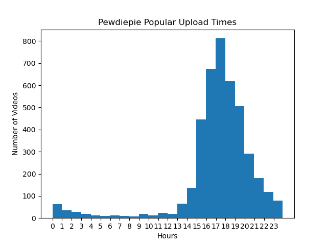

# YT_API_Python_Data

Python script that shows a sample of Pewdiepie's channel popular uploading times using the YouTube API. The Oldest Search Youtube Video script finds the first video uploaded containing the words "league of legends".

## Getting Started

Set up environment on Visual Studio Code. Obtain a YOUTUBE_DEVELOPER_KEY on Google Cloud Platform Console. Install the proper packages.
Modify the timezone in the script.

### Installation

```
!pip install DateTime
!pip install timedelta
!pip install google-api-python-client
!pip install matplotlib
!pip install python-csv
!pip install youtube-data-api
!pip install pprintpp
```

## Data Cleanse

Modify the timezone for the timedelta.

```
#Add timedelta for GMT timezone
#            + timedelta(hours=5, minutes=30))
```

### Data Visualizations

Sample data visualization of Pewdiepie Channel Upload Hours.




## Authors

* **nikhilkumarsingh** - *Initial work* - [YouTubeAPI-Examples](https://github.com/nikhilkumarsingh/YouTubeAPI-Examples)
* **Crystal14w** - *Gaming and Tech Channel search* - [Game Channel Pewdiepie](https://github.com/Crystal14w/YT_API_Python_Data/blob/master/Pewdiepie_Popular_Upload_Times.py) 

## Acknowledgments

*Thanks to Nikhil Kumarsingh for posting a Youtube video explaining the video search and oldest video search with the YouTube API.

## Resources
- [Youtube Video_Search](https://www.youtube.com/watch?v=b_jOJNUD350&list=PLO47T5JD6tWQdn5JeHzIArpe6KsDFZW-D&index=1)
- [Youtube Video Oldest Video](https://www.youtube.com/watch?v=H4fQUHVvbX8&list=PLO47T5JD6tWQdn5JeHzIArpe6KsDFZW-D&index=2)
